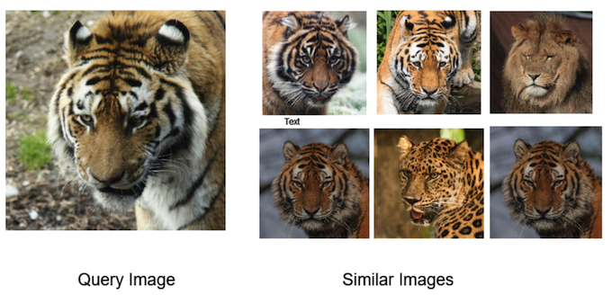

[](https://badge.fury.io/py/similarities)
[](https://pepy.tech/project/similarities)
[](CONTRIBUTING.md)
[](https://github.com/shibing624/similarities/graphs/contributors)
[](LICENSE)
[](requirements.txt)
[](https://github.com/shibing624/similarities/issues)
[](#Contact)

# Similarities

Similarities is a toolkit for similarity calculation and semantic search, supports text and image.

similarities：相似度计算、语义匹配搜索工具包。

**similarities** 实现了多种相似度计算、匹配搜索算法，支持文本、图像，python3开发，pip安装，开箱即用。

**Guide**

- [Feature](#Feature)
- [Evaluation](#Evaluation)
- [Install](#install)
- [Usage](#usage)
- [Contact](#Contact)
- [Reference](#reference)

# Feature

### 文本相似度计算（文本匹配）
- 余弦相似（Cosine Similarity）：两向量求余弦
- 点积（Dot Product）：两向量归一化后求内积
- 汉明距离（Hamming Distance），编辑距离（Levenshtein Distance），欧氏距离（Euclidean Distance），曼哈顿距离（Manhattan Distance）等

#### 语义模型
- [CoSENT文本匹配模型](https://github.com/shibing624/similarities/blob/main/similarities/similarity.py#L79)[推荐]
- BERT模型（文本向量表征）
- SentenceBERT文本匹配模型


#### 字面模型
- [Word2Vec文本浅层语义表征](https://github.com/shibing624/similarities/blob/main/similarities/literalsim.py#L374)[推荐]
- 同义词词林
- 知网Hownet义原匹配
- BM25、RankBM25
- TFIDF
- SimHash

### 图像相似度计算（图像匹配）
#### 语义模型
- [CLIP(Contrastive Language-Image Pre-Training)](https://github.com/shibing624/similarities/blob/main/similarities/imagesim.py#L25)
- VGG(doing)
- ResNet(doing)

#### 特征提取
- [pHash](https://github.com/shibing624/similarities/blob/main/similarities/imagesim.py#L164)[推荐], dHash, wHash, aHash
- SIFT, Scale Invariant Feature Transform(SIFT)
- SURF, Speeded Up Robust Features(SURF)(doing)

### 图文相似度计算
- [CLIP(Contrastive Language-Image Pre-Training)](https://github.com/shibing624/similarities/blob/main/similarities/imagesim.py#L25)

### 匹配搜索
- [SemanticSearch](https://github.com/shibing624/similarities/blob/main/similarities/similarity.py#L185)：向量相似检索，使用Cosine
  Similarty + topk高效计算，比一对一暴力计算快一个数量级

# Demo

Official Demo: http://42.193.145.218/product/short_text_sim/

HuggingFace Demo: https://huggingface.co/spaces/shibing624/text2vec


# Evaluation
### 文本匹配和文本检索
#### 中文文本匹配模型评测结果

| Model | ATEC | BQ | LCQMC | PAWSX | STS-B | Avg | QPS |
| :---- | :-: | :-: | :-: | :-: | :-: | :-: | :-: |
| Word2Vec | 20.00 | 31.49 | 59.46 | 2.57 | 55.78 | 33.86 | 10283 |
| SBERT-multi | 18.42 | 38.52 | 63.96 | 10.14 | 78.90 | 41.99 | 2371 |
| Text2vec | 31.93 | 42.67 | 70.16 | 17.21 | 79.30 | **48.25** | 2572 |

> 结果值使用spearman系数

Model(doing):
- Cilin
- Hownet
- SimHash
- TFIDF

#### 文本检索评测结果

| Model | MS MARCO | QPS |
| :---- | :-: | :-: |
| Word2Vec | - | - |
| SBERT-multi | - | - |
| Text2vec | - | - |
| BM25 | - | - |
| ColBERT | - | - |

> 结果值使用MRR@10、nDCG@10
### 图像匹配和图像检索
#### 图像匹配模型评测结果

缺标准评估数据集

> 结果值使用F1
#### 图像检索评测结果

缺标准评估数据集

> 结果值使用MRR@10、nDCG@10


# Install

```
pip3 install torch # conda install pytorch
pip3 install -U similarities
```

or

```
git clone https://github.com/shibing624/similarities.git
cd similarities
python3 setup.py install
```

# Usage

### 1. 文本语义相似度计算

```python
from similarities import Similarity

m = Similarity()
r = m.similarity('如何更换花呗绑定银行卡', '花呗更改绑定银行卡')
print(f"similarity score: {float(r)}")  # similarity score: 0.855146050453186
```

> 余弦值`score`范围是[-1, 1]，值越大越相似。

### 2. 文本语义匹配搜索

一般在文档候选集中找与query最相似的文本，常用于QA场景的问句相似匹配、文本相似检索等任务。

example: [examples/base_demo.py](./examples/base_demo.py)

```python
import sys

sys.path.append('..')
from similarities import Similarity

# 1.Compute cosine similarity between two sentences.
sentences = ['如何更换花呗绑定银行卡',
             '花呗更改绑定银行卡']
corpus = [
    '花呗更改绑定银行卡',
    '我什么时候开通了花呗',
    '俄罗斯警告乌克兰反对欧盟协议',
    '暴风雨掩埋了东北部；新泽西16英寸的降雪',
    '中央情报局局长访问以色列叙利亚会谈',
    '人在巴基斯坦基地的炸弹袭击中丧生',
]
model = Similarity(model_name_or_path="shibing624/text2vec-base-chinese")
print(model)
similarity_score = model.similarity(sentences[0], sentences[1])
print(f"{sentences[0]} vs {sentences[1]}, score: {float(similarity_score):.4f}")

print('-' * 50 + '\n')
# 2.Compute similarity between two list
similarity_scores = model.similarity(sentences, corpus)
print(similarity_scores.numpy())
for i in range(len(sentences)):
    for j in range(len(corpus)):
        print(f"{sentences[i]} vs {corpus[j]}, score: {similarity_scores.numpy()[i][j]:.4f}")

print('-' * 50 + '\n')
# 3.Semantic Search
model.add_corpus(corpus)
res = model.most_similar(queries=sentences, topn=3)
print(res)
for q_id, c in res.items():
    print('query:', sentences[q_id])
    print("search top 3:")
    for corpus_id, s in c.items():
        print(f'\t{model.corpus[corpus_id]}: {s:.4f}')
```

output:

```shell
如何更换花呗绑定银行卡 vs 花呗更改绑定银行卡, score: 0.8551
...

如何更换花呗绑定银行卡 vs 花呗更改绑定银行卡, score: 0.8551
如何更换花呗绑定银行卡 vs 我什么时候开通了花呗, score: 0.7212
如何更换花呗绑定银行卡 vs 俄罗斯警告乌克兰反对欧盟协议, score: 0.1450
如何更换花呗绑定银行卡 vs 暴风雨掩埋了东北部；新泽西16英寸的降雪, score: 0.2167
如何更换花呗绑定银行卡 vs 中央情报局局长访问以色列叙利亚会谈, score: 0.2517
如何更换花呗绑定银行卡 vs 人在巴基斯坦基地的炸弹袭击中丧生, score: 0.0809
花呗更改绑定银行卡 vs 花呗更改绑定银行卡, score: 1.0000
花呗更改绑定银行卡 vs 我什么时候开通了花呗, score: 0.6807
花呗更改绑定银行卡 vs 俄罗斯警告乌克兰反对欧盟协议, score: 0.1714
花呗更改绑定银行卡 vs 暴风雨掩埋了东北部；新泽西16英寸的降雪, score: 0.2162
花呗更改绑定银行卡 vs 中央情报局局长访问以色列叙利亚会谈, score: 0.2728
花呗更改绑定银行卡 vs 人在巴基斯坦基地的炸弹袭击中丧生, score: 0.1279

query: 如何更换花呗绑定银行卡
search top 3:
	花呗更改绑定银行卡: 0.8551
	我什么时候开通了花呗: 0.7212
	中央情报局局长访问以色列叙利亚会谈: 0.2517
```

> 余弦`score`的值范围[-1, 1]，值越大，表示该query与corpus的文本越相似。


#### 英文语义相似度计算和匹配搜索

example: [examples/base_english_demo.py](./examples/base_english_demo.py)

### 3. 快速近似语义匹配搜索

支持Annoy、Hnswlib的近似语义匹配搜索，常用于百万数据集的匹配搜索任务。

example: [examples/fast_sim_demo.py](./examples/fast_sim_demo.py)

### 4. 基于字面的文本相似度计算和匹配搜索

支持同义词词林（Cilin）、知网Hownet、词向量（WordEmbedding）、Tfidf、SimHash、BM25等算法的相似度计算和字面匹配搜索，常用于文本匹配冷启动。

example: [examples/literal_sim_demo.py](./examples/literal_sim_demo.py)

```python
from similarities.literalsim import SimHashSimilarity, TfidfSimilarity, BM25Similarity, \
    WordEmbeddingSimilarity, CilinSimilarity, HownetSimilarity

text1 = "如何更换花呗绑定银行卡"
text2 = "花呗更改绑定银行卡"

corpus = [
    '花呗更改绑定银行卡',
    '我什么时候开通了花呗',
    '俄罗斯警告乌克兰反对欧盟协议',
    '暴风雨掩埋了东北部；新泽西16英寸的降雪',
    '中央情报局局长访问以色列叙利亚会谈',
    '人在巴基斯坦基地的炸弹袭击中丧生',
]

queries = [
    '我的花呗开通了？',
    '乌克兰被俄罗斯警告'
]
m = TfidfSimilarity()
print(text1, text2, ' sim score: ', m.similarity(text1, text2))

m.add_corpus(corpus)
res = m.most_similar(queries, topn=3)
print('sim search: ', res)
for q_id, c in res.items():
    print('query:', queries[q_id])
    print("search top 3:")
    for corpus_id, s in c.items():
        print(f'\t{m.corpus[corpus_id]}: {s:.4f}')
```

output:

```shell
如何更换花呗绑定银行卡 花呗更改绑定银行卡  sim score:  0.8203384355246909

sim search:  {0: {2: 0.9999999403953552, 1: 0.43930041790008545, 0: 0.0}, 1: {0: 0.7380483150482178, 1: 0.0, 2: 0.0}}
query: 我的花呗开通了？
search top 3:
	我什么时候开通了花呗: 1.0000
	花呗更改绑定银行卡: 0.4393
	俄罗斯警告乌克兰反对欧盟协议: 0.0000
...
```

### 5. 图像相似度计算和匹配搜索

支持[CLIP](similarities/imagesim.py)、pHash、SIFT等算法的图像相似度计算和匹配搜索。

example: [examples/image_demo.py](./examples/image_demo.py)

```python
import sys
import glob
from PIL import Image

sys.path.append('..')
from similarities.imagesim import ImageHashSimilarity, SiftSimilarity, ClipSimilarity


def sim_and_search(m):
    print(m)
    # similarity
    sim_scores = m.similarity(imgs1, imgs2)
    print('sim scores: ', sim_scores)
    for (idx, i), j in zip(enumerate(image_fps1), image_fps2):
        s = sim_scores[idx] if isinstance(sim_scores, list) else sim_scores[idx][idx]
        print(f"{i} vs {j}, score: {s:.4f}")
    # search
    m.add_corpus(corpus_imgs)
    queries = imgs1
    res = m.most_similar(queries, topn=3)
    print('sim search: ', res)
    for q_id, c in res.items():
        print('query:', image_fps1[q_id])
        print("search top 3:")
        for corpus_id, s in c.items():
            print(f'\t{m.corpus[corpus_id].filename}: {s:.4f}')
    print('-' * 50 + '\n')

image_fps1 = ['data/image1.png', 'data/image3.png']
image_fps2 = ['data/image12-like-image1.png', 'data/image10.png']
imgs1 = [Image.open(i) for i in image_fps1]
imgs2 = [Image.open(i) for i in image_fps2]
corpus_fps = glob.glob('data/*.jpg') + glob.glob('data/*.png')
corpus_imgs = [Image.open(i) for i in corpus_fps]

# 2. image and image similarity score
sim_and_search(ClipSimilarity())  # the best result
sim_and_search(ImageHashSimilarity(hash_function='phash'))
sim_and_search(SiftSimilarity())
```

output:

```shell
Similarity: ClipSimilarity, matching_model: CLIPModel
sim scores:  tensor([[0.9580, 0.8654],
        [0.6558, 0.6145]])

data/image1.png vs data/image12-like-image1.png, score: 0.9580
data/image3.png vs data/image10.png, score: 0.6145

sim search:  {0: {6: 0.9999999403953552, 0: 0.9579654932022095, 4: 0.9326782822608948}, 1: {8: 0.9999997615814209, 4: 0.6729235649108887, 0: 0.6558331847190857}}

query: data/image1.png
search top 3:
	data/image1.png: 1.0000
	data/image12-like-image1.png: 0.9580
	data/image8-like-image1.png: 0.9327
```



### 6. 图文互搜

CLIP 模型不仅支持以图搜图，还支持图文互搜：
```python
import sys
import glob
from PIL import Image
sys.path.append('..')
from similarities.imagesim import ImageHashSimilarity, SiftSimilarity, ClipSimilarity

m = ClipSimilarity()
print(m)
# similarity score between text and image
image_fps = ['data/image3.png',  # yellow flower image
             'data/image1.png']  # tiger image
texts = ['a yellow flower', 'a tiger']
imgs = [Image.open(i) for i in image_fps]
sim_scores = m.similarity(imgs, texts)

print('sim scores: ', sim_scores)
for (idx, i), j in zip(enumerate(image_fps), texts):
    s = sim_scores[idx][idx]
    print(f"{i} vs {j}, score: {s:.4f}")
```

output:

```shell
sim scores:  tensor([[0.3220, 0.2409],
        [0.1677, 0.2959]])
data/image3.png vs a yellow flower, score: 0.3220
data/image1.png vs a tiger, score: 0.2959
```

# Contact

- Issue(建议)
  ：[](https://github.com/shibing624/similarities/issues)
- 邮件我：xuming: xuming624@qq.com
- 微信我： 加我*微信号：xuming624, 备注：姓名-公司-NLP* 进NLP交流群。


# Citation

如果你在研究中使用了similarities，请按如下格式引用：

APA:

```
Xu, M. Similarities: Compute similarity score for humans (Version 1.0.1) [Computer software]. https://github.com/shibing624/similarities
```

BibTeX:

```
@software{Xu_Similarities_Compute_similarity,
author = {Xu, Ming},
title = {Similarities: similarity calculation and semantic search toolkit},
url = {https://github.com/shibing624/similarities},
version = {1.0.1}
}
```

# License

授权协议为 [The Apache License 2.0](/LICENSE)，可免费用做商业用途。请在产品说明中附加similarities的链接和授权协议。

# Contribute

项目代码还很粗糙，如果大家对代码有所改进，欢迎提交回本项目，在提交之前，注意以下两点：

- 在`tests`添加相应的单元测试
- 使用`python setup.py test`来运行所有单元测试，确保所有单测都是通过的

之后即可提交PR。

# Reference

- [A Simple but Tough-to-Beat Baseline for Sentence Embeddings[Sanjeev Arora and Yingyu Liang and Tengyu Ma, 2017]](https://openreview.net/forum?id=SyK00v5xx)
- [liuhuanyong/SentenceSimilarity](https://github.com/liuhuanyong/SentenceSimilarity)
- [shibing624/text2vec](https://github.com/shibing624/text2vec)
- [qwertyforce/image_search](https://github.com/qwertyforce/image_search)
- [ImageHash - Official Github repository](https://github.com/JohannesBuchner/imagehash)
- [openai/CLIP](https://github.com/openai/CLIP)