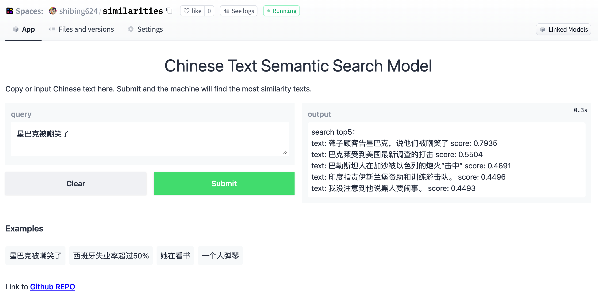

[](https://badge.fury.io/py/similarities)
[](https://pepy.tech/project/similarities)
[](CONTRIBUTING.md)
[](LICENSE)
[](requirements.txt)
[](https://github.com/shibing624/similarities/issues)
[](#Contact)

# Similarities

Similarities is a toolkit for similarity calculation and semantic search, supports text and image.

similarities：相似度计算、语义匹配搜索工具包。

**similarities** 实现了多种相似度计算、语义匹配检索算法，支持亿级数据文搜文、文搜图、图搜图，python3开发，pip安装，开箱即用。

**Guide**

- [Features](#Features)
- [Install](#install)
- [Usage](#usage)
- [Contact](#Contact)
- [Acknowledgements](#Acknowledgements)

## Features

### 文本相似度计算 + 文本搜索

- 语义匹配模型【推荐】：本项目基于text2vec实现了CoSENT模型的文本相似度计算和文本搜索，支持中英文、多语言多种SentenceBERT类预训练模型，支持 Cos Similarity/Dot Product/Hamming Distance/Euclidean Distance 等多种相似度计算方法，支持 SemanticSearch/Faiss/Annoy/Hnsw 等多种文本搜索算法，支持亿级数据高效检索
- 字面匹配模型：本项目实现了Word2Vec、BM25、RankBM25、TFIDF、SimHash、同义词词林、知网Hownet义原匹配等多种字面匹配模型


### 图像相似度计算/图文相似度计算 + 图搜图/文搜图
- 英文CLIP(Contrastive Language-Image Pre-Training)模型：OpenAI提出的图文匹配模型，可用于图文特征（embeddings）、相似度计算、图文检索、零样本图片分类，本项目实现了[openai/clip-vit-base-patch32](https://huggingface.co/openai/clip-vit-base-patch32)等CLIP系列模型的图文检索功能
- 中文CLIP模型【推荐】：阿里使用~2亿图文对训练，发布的中文CLIP模型，支持[OFA-Sys/chinese-clip-vit-base-patch16](https://huggingface.co/OFA-Sys/chinese-clip-vit-base-patch16)等Chinese-CLIP系列模型，本项目基于PyTorch实现了中文CLIP模型的向量表征、构建索引（基于autofaiss）、批量检索、后台服务（基于Fastapi）、前端展现（基于gradio）功能
- 图像特征提取：本项目基于cv2实现了pHash、dHash、wHash、aHash、SIFT等多种图像特征提取算法

## Demo

Text Search Demo: https://huggingface.co/spaces/shibing624/similarities




## Install

```
pip3 install torch # conda install pytorch
pip3 install -U similarities
```

or

```
git clone https://github.com/shibing624/similarities.git
cd similarities
python3 setup.py install
```

## Usage

### 1. 文本相似度计算

example: [examples/text_similarity_demo.py](https://github.com/shibing624/similarities/blob/main/examples/text_similarity_demo.py)


```python
from similarities import BertSimilarity

m = BertSimilarity(model_name_or_path="shibing624/text2vec-base-chinese")
r = m.similarity('如何更换花呗绑定银行卡', '花呗更改绑定银行卡')
print(f"similarity score: {float(r)}")  # similarity score: 0.855146050453186
```

### 2. 文本搜索

一般在文档候选集中找与query最相似的文本，常用于QA场景的问句相似匹配、文本搜索(百万内数据集)等任务。

example: [examples/text_semantic_search_demo.py](https://github.com/shibing624/similarities/blob/main/examples/text_semantic_search_demo.py)


#### 多语言文本相似度计算和文本搜索

使用[shibing624/text2vec-base-multilingual](https://huggingface.co/shibing624/text2vec-base-multilingual)模型，支持中、英、韩、日、德、意等多国语言

example: [examples/text_semantic_search_multilingual_demo.py](https://github.com/shibing624/similarities/blob/main/examples/text_semantic_search_multilingual_demo.py)

### 3. 近似文本搜索

支持Annoy、Hnswlib的近似语义匹配搜索，常用于百万数据集的匹配搜索任务。

example: [examples/fast_text_semantic_search_demo.py](https://github.com/shibing624/similarities/blob/main/examples/fast_text_semantic_search_demo.py)

### 4. 基于字面的文本相似度计算和文本搜索

支持同义词词林（Cilin）、知网Hownet、词向量（WordEmbedding）、Tfidf、SimHash、BM25等算法的相似度计算和字面匹配搜索，常用于文本匹配冷启动。

example: [examples/literal_text_semantic_search_demo.py](https://github.com/shibing624/similarities/blob/main/examples/literal_text_semantic_search_demo.py)

### 5. 图像相似度计算和图片搜索

支持CLIP、pHash、SIFT等算法的图像相似度计算和匹配搜索，中文 CLIP 模型支持图搜图，文搜图、还支持中英文图文互搜。

example: [examples/image_semantic_search_demo.py](https://github.com/shibing624/similarities/blob/main/examples/image_semantic_search_demo.py)


## Contact

- Issue(建议)
  ：[](https://github.com/shibing624/similarities/issues)
- 邮件我：xuming: xuming624@qq.com
- 微信我： 加我*微信号：xuming624, 备注：姓名-公司-NLP* 进NLP交流群。


## Citation

如果你在研究中使用了similarities，请按如下格式引用：

APA:

```
Xu, M. Similarities: Compute similarity score for humans (Version 1.0.1) [Computer software]. https://github.com/shibing624/similarities
```

BibTeX:

```
@misc{Xu_Similarities_Compute_similarity,
  title={Similarities: similarity calculation and semantic search toolkit},
  author={Xu Ming},
  year={2022},
  howpublished={\url{https://github.com/shibing624/similarities}},
}
```

## License

授权协议为 [The Apache License 2.0](/LICENSE)，可免费用做商业用途。请在产品说明中附加similarities的链接和授权协议。

## Contribute

项目代码还很粗糙，如果大家对代码有所改进，欢迎提交回本项目，在提交之前，注意以下两点：

- 在`tests`添加相应的单元测试
- 使用`python -m pytest`来运行所有单元测试，确保所有单测都是通过的

之后即可提交PR。

## Acknowledgements 

- [A Simple but Tough-to-Beat Baseline for Sentence Embeddings[Sanjeev Arora and Yingyu Liang and Tengyu Ma, 2017]](https://openreview.net/forum?id=SyK00v5xx)
- [https://github.com/liuhuanyong/SentenceSimilarity](https://github.com/liuhuanyong/SentenceSimilarity)
- [https://github.com/qwertyforce/image_search](https://github.com/qwertyforce/image_search)
- [ImageHash - Official Github repository](https://github.com/JohannesBuchner/imagehash)
- [https://github.com/openai/CLIP](https://github.com/openai/CLIP)
- [https://github.com/OFA-Sys/Chinese-CLIP](https://github.com/OFA-Sys/Chinese-CLIP)
- [https://github.com/UKPLab/sentence-transformers](https://github.com/UKPLab/sentence-transformers)
- [https://github.com/rom1504/clip-retrieval](https://github.com/rom1504/clip-retrieval)

Thanks for their great work!
